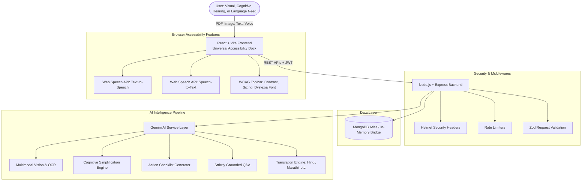
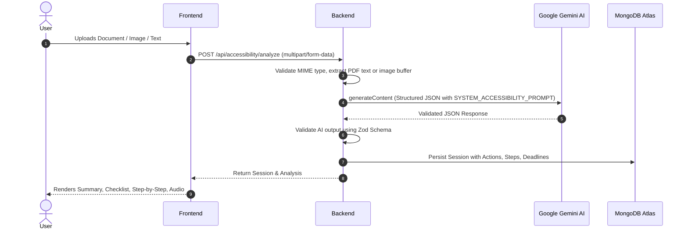

# SARTHI — System Architecture

> **Tagline:** Understand. Hear. Translate. Act.  
> **Challenge:** AI for Accessibility & Inclusion

---

## 1. System Overview

**SARTHI** is an AI-powered accessibility platform designed to eliminate cognitive, sensory, and linguistic barriers when interacting with complex digital documents (government schemes, medical instructions, bank notifications, educational guidelines, and utility forms).

Rather than acting as a generic conversational chatbot, SARTHI serves as an adaptive accessibility layer that converts dense information into structured, actionable checklists, plain-language summaries, single-step focus guides, and audio narrations.

---

## 2. Frontend Architecture

- **Framework:** React 18 with Vite for lightning-fast HMR and optimized production bundles.
- **Routing:** React Router v6 (`/`, `/workspace`, `/dashboard`, `/login`, `/register`).
- **Styling:** Tailwind CSS with custom WCAG accessibility utility classes:
  - `.contrast-dark`: High-contrast amber (`#fbbf24`) on pure black (`#050608`).
  - `.contrast-light`: High-contrast black on crisp white with bold 2px borders.
  - `.text-size-large` (115%) and `.text-size-xlarge` (130%).
  - `.reading-mode`: Enhanced letter-spacing (`0.05em`), word-spacing (`0.12em`), and line-height (`1.85`).
  - `.reduced-motion`: Disables transitions and animations for vestibular accessibility.
  - `:focus-visible`: High-visibility amber focus ring (`outline: 3px solid #f59e0b`).
- **State Management:**
  - `AuthContext.jsx`: Manages token, profile, and automatic preference syncing.
  - `AccessibilityContext.jsx`: Controls text sizes, contrast modes, dyslexia settings, Web Speech API speech synthesis, speech recognition, and screen reader announcements (`aria-live="polite"`).
- **Core Components:**
  - `AccessibilityToolbar.jsx`: Universal floating/docked accessibility drawer.
  - `ActionChecklist.jsx`: "WHAT DO I NEED TO DO?" interactive checklist with progress tracking.
  - `StepByStepCard.jsx`: Cognitive accessibility single-step focus card.
  - `SimplerModeView.jsx`: Plain language breakdown with "Make it even simpler" slider.
  - `TranslationTab.jsx`: Multilingual translation (Marathi, Hindi, Gujarati, etc.).
  - `GroundedQnA.jsx`: Contextual Q&A strictly grounded in the document with zero hallucination.
  - `AudioPlayerDock.jsx`: Persistent audio playback controls with animated sound waves.

---

## 3. Backend Architecture

- **Runtime:** Node.js v22 (ES Modules).
- **Framework:** Express.js with a modular controller-service-repository pattern:
  - `config/`: Environment configuration (`env.js`) and database connector (`db.js`).
  - `middleware/`: JWT verification, optional auth for guests, Zod request body validation, Multer in-memory file uploads, rate limiting, and centralized error handling.
  - `models/`: Mongoose schemas (`User.js`, `Session.js`) combined with `userRepo.js` and `sessionRepo.js` providing an automatic in-memory fallback store if MongoDB Atlas is temporarily unreachable.
  - `services/ai/`: Isolated AI intelligence layer (`geminiService.js`, `prompts.js`, `schemas.js`).
  - `validators/`: Zod schemas for auth, document analysis, Q&A, and AI structured output validation.
  - `utils/`: Robust PDF text extractor (`pdfExtractor.js`) and verified sample dataset (`sampleDocument.js`).

---

## 4. AI Analysis Pipeline & Grounding

SARTHI AI operates on three core principles: **Empowerment, Cognitive Simplicity, and Zero Hallucination**.

### Prompt Engineering Guardrails
1. **Factual Grounding:** Prompts instruct the model to extract *only* what is stated in the document.
2. **Missing Information Flagging:** Identifies gaps in official notices (e.g., missing helpdesk contact or unstated fee amounts).
3. **Structured Output:** Enforces strict adherence to JSON schemas (`contentType`, `requiredActions`, `steps`, `deadlines`, `requiredDocuments`, `suggestedQuestions`).
4. **Resilient Fallback Engine:** If an API key is missing or quota is exceeded during an offline demo, SARTHI's heuristic accessibility engine parses key dates, IDs, and action items to guarantee uninterrupted presentation.

---

## 5. Security & Privacy

- **Password Security:** Salted hashing with `bcryptjs` (10 rounds).
- **Session Security:** Cryptographically signed JWT tokens with expiration.
- **API Key Protection:** `GEMINI_API_KEY` is strictly held on the server; never exposed to the client.
- **Request Hygiene:** Express rate limiting, Helmet HTTP security headers, CORS origin whitelisting, and strict 10 MB payload limits.
- **Privacy:** In-memory file processing via Multer memory storage; raw uploaded files are not indefinitely stored on server disks.

---

## 6. Production Deployment

- **Frontend Deployment:** Vercel via `vercel.json` with single-page application route rewrites.
- **Backend Deployment:** Render via `render.yaml` with managed environment variables and health check routes.
- **Database:** MongoDB Atlas M0/M10 managed cluster.
